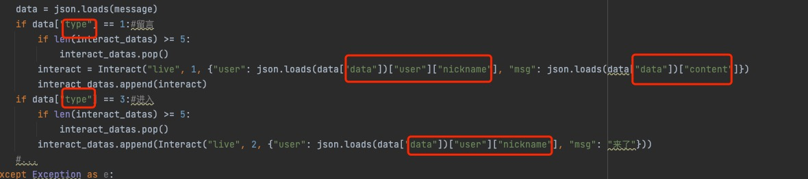

# douyin
抖音[直播伴侣]推流密钥获取工具
抖音直播间弹幕、进入房间等数据获取，通过Websocket对接Fay

### 大概思路
通过中间人代理获取开播返回的rtmp地址

### 实现流程
1. 用户安装CA证书
2. 启动代理服务器
3. 检测到开播
4. 解析得出RTMP地址
5. 强制结束直播伴侣(不能点断开)
6. OBS介入推流
7. 关闭代理服务器
8. 退出本进程


### OpenSSL生成证书
```bash
./certificates/generate-certificates.sh
```

### MacOS信任证书
```bash
sudo security add-trusted-cert -d -r trustRoot -k /Library/Keychains/System.keychain ./certificates/proxy-ca.crt
```
### Windows信任证书
1. 双击打开./certificates/proxy-ca.crt,点击【安装证书】
2. 选择【本地计算机】并单击下一步
3. 选择【将所有的证书都放入下列存储(P)】-> 点击【浏览】
4. 选中第二个【受信任的根证书颁发机构】-> 点击【确定】-> 选择【下一步】
5. 选择【完成】-> 点击【确定】-> 点击【确定】
###

### Android信任证书
1. 将proxy-ca.crt发至手机
2. 。。。。

### Ios信任证书
1. 将proxy-ca.crt发至手机
2. 。。。。

## 注意事项
要关直播请再次运行直播伴侣 点 继续直播 然后再关闭直播 否则就算不推流了也不会立刻下播（懒得写下播了）

### Fay中需将json的大写首字母改成小写



### 感谢
- [goproxy](https://github.com/elazarl/goproxy)
- [Fay](https://github.com/TheRamU/Fay)
- [get-douyin-rtmp](https://github.com/Cloud370/get-douyin-rtmp)